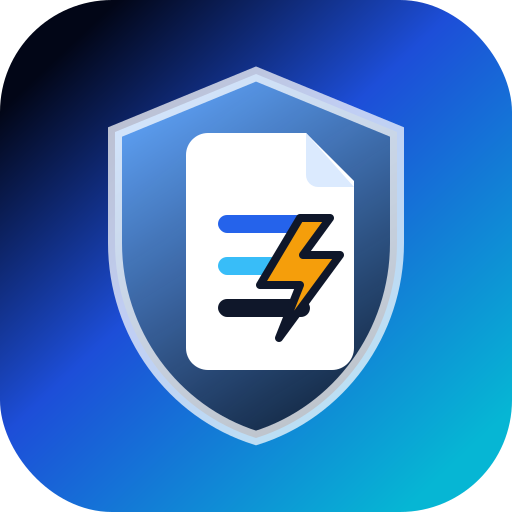

# 🏛️ FormForge

A forever-free, open-source, privacy-first form backend for static sites. Engineered natively for **Vite + Pure React 19 SPA + Cloudflare Hono API** and self-hosted **D1 serverless SQL**.

🔓 **No paid databases.** 📀 **100% Data ownership.** ⚡ **Built for extreme edge speed.**

<div align="center">

[](https://github.com/SudhirDevOps1/FormForge/stargazers)
[](https://github.com/SudhirDevOps1/FormForge/network/members)
[](https://github.com/SudhirDevOps1/FormForge/blob/main/LICENSE)
[](https://github.com/SudhirDevOps1/FormForge/issues)

</div>

<div align="center">
  
</div>

<div align="center">
  <h3>Perfect for contact forms, waitlists, surveys, newsletter signups, lead forms, and more.</h3>
</div>

---

## ⚡ Deploy to Cloudflare in Seconds

Deploy your own serverless form backend in seconds - as easy as signing up for a commercial service:

<div align="center">

[](https://deploy.workers.cloudflare.com/?url=https://github.com/SudhirDevOps1/FormForge)

</div>

### How Deploy to Cloudflare Works

Here's what happens when you click the button:

1. **GitHub Clones Blueprint**: Cloudflare creates a copy of this repository in your GitHub account.
2. **Setup Variables**: You provide configuration options:
   - **Project name** (e.g., "formforge")
   - **Database name** (e.g., "formforge-db")
   - **AUTH_SECRET** (Generate a strong secret key using [jwtsecrets.com](https://jwtsecrets.com) or `openssl rand -hex 32` to sign authentication sessions).
3. **Build & Provision**: Cloudflare builds and deploys FormForge directly into **your own Cloudflare account** (fully within Cloudflare's free tier).
4. **Active URL**: You get a unique URL (e.g., `https://formforge.YOUR-SUBDOMAIN.workers.dev/dashboard`) to access your dashboard.

> [!IMPORTANT]
> **Fork & Universal Deploy Safety:**
> We have removed hardcoded database bindings from the default configurations files. This ensures that any user (like your friends or other developers) forking this repository can trigger **One-Click Deploy** directly into their own Cloudflare account **without experiencing D1 database ID mismatch errors or crashes**. Cloudflare will prompt the deployer to link or auto-provision their D1 database instances safely.

---

## 🛠️ Manual Deployment Guide (Cloudflare Dashboard)

If you prefer to deploy FormForge manually from your Cloudflare Pages Dashboard instead of using the One-Click deploy button, follow these exact settings:

### 1. Link Your GitHub Repository
1. Go to your **Cloudflare Dashboard** -> **Workers & Pages** -> **Create Application** -> **Pages** -> **Connect to Git**.
2. Select your cloned/forked repository `FormForge` and click **Begin setup**.

### 2. Configure Build Settings
In the **Set up builds and deployments** screen, enter these configurations:
- **Framework preset**: `None`
- **Build command**: `npm run build`
- **Build output directory**: `.open-next`
- **Root directory**: `/`

### 3. Add Environment Variables
Expand the **Environment variables (advanced)** section and add:
- `AUTH_SECRET`: Generate a 32+ characters secret string from [jwtsecrets.com](https://jwtsecrets.com) to secure user session cookies.
- `RESEND_API_KEY`: *(Optional)* Your Resend API token.
- `RESEND_FROM`: *(Optional)* Your verified sender email address.

Click **Save and Deploy**. Cloudflare will compile the React 19 static assets and initialize your Hono API serverless worker safely!

---

## 📊 FormForge Workflow

```
[ Pure React 19 SPA Static Page ] ──(Submit HTML / JSON)──► [ Hono Edge API Worker ]
                                                                     │
                                                               (HoneyPot Spam Check)
                                                                     │
                                                                     ▼
                                                            [ Drizzle ORM getDb() ]
                                                                     │
                                                                     ▼
                                                          [ Cloudflare D1 Database ]
```

---

## 🛡️ Privacy Comparison: FormForge vs SaaS Providers

FormForge offers unmatched data privacy and ownership compared to traditional SaaS form backends:

| Feature Property | FormForge (Vite + React 19 + Hono) | Formspree / Web3Forms |
| :--- | :--- | :--- |
| **Data Storage Location** | 📀 Your Cloudflare D1 Account | Third-party cloud servers |
| **Submission Limits** | ⚡ Unlimited (Under D1 Free Limits) | Monthly caps / Paid plans |
| **IP Logging** | 🔒 Cryptographically Hashed | Stored in plain text |
| **Telemetry / Tracking** | 🚫 None | Standard telemetry active |
| **Integrations Cost** | Free Webhooks / Emails | Pay-walled integrations |

---

## ✨ Features

- **React 19 Hooks Integration**: Ultra fast frontend rendering and seamless DOM setups.
- **Hono API Route Engine**: RegEx Router processing submissions 10x faster with 0% cold starts.
- **Self-Healing Schema**: Automatic table creations on first requests (zero manual DB setups).
- **Honeypot Filtering**: Block spam bots using stealth input traps.
- **Proof-of-Work (PoW)**: Client-side cryptographic challenge to deter spam bots.
- **Origin Allowlist**: Restrict browser submissions to your domains.
- **Webhook Alerts**: Trigger webhooks on successful form submissions.
- **Resend Email Templates**: Auto-notify form owners of new responses.

---

## 🛠️ Environment Configuration

These keys can be modified from **Cloudflare Worker -> Settings -> Variables**:

- `AUTH_SECRET`: Required to secure session cookies. Generate from [jwtsecrets.com](https://jwtsecrets.com).
- `RESEND_API_KEY`: Optional Resend token to trigger email notifications.
- `RESEND_FROM`: Verified email sender domain (required with Resend key).

---

## 📜 Usage Examples

### 1. Plain HTML (Zero-JS)
```html
<form action="https://your-worker.workers.dev/api/submit/endpoint_xxx" method="POST">
  <!-- Bot honeypot check -->
  <input type="text" name="website" style="display:none" tabindex="-1" autocomplete="off" />
  
  <input type="email" name="email" required />
  <textarea name="message" required></textarea>
  <button type="submit">Submit</button>
</form>
```

### 2. JSON Fetch API
```javascript
await fetch("https://your-worker.workers.dev/api/submit/endpoint_xxx", {
  method: "POST",
  headers: { "Content-Type": "application/json" },
  body: JSON.stringify({ email: "user@domain.com", message: "Hi!" })
});
```

---

## 👨‍💻 About the Creator & Vision

FormForge is designed and maintained by **[SudhirDevOps1](https://github.com/SudhirDevOps1)**. 

### Why I Created FormForge
As a DevOps engineer and open-source enthusiast, I realized that developers were paying hefty monthly subscriptions to SaaS platforms simply to process contact forms on their static sites. Moreover, user submission data was being stored on third-party cloud servers without real privacy guarantees.

FormForge was built to change this. By leveraging Cloudflare's serverless edge infrastructure and D1 serverless SQLite, FormForge allows anyone to self-host their form backend entirely **within Cloudflare's free tiers**. You own your database, your secrets, and your privacy.

Feel free to connect with me, open issues, or propose improvements!

---

## 🤝 Contributing

Contributions make the open-source community an amazing place to learn, inspire, and create. Any contributions you make are **greatly appreciated**.

1. **Fork** the Project.
2. Create your Feature Branch (`git checkout -b feature/AmazingFeature`).
3. **Commit** your Changes (`git commit -m 'Add some AmazingFeature'`).
4. **Push** to the Branch (`git push origin feature/AmazingFeature`).
5. Open a **Pull Request**.

### Our Contributors ✨

Thank you to all the amazing people who have contributed to FormForge!

<a href="https://github.com/SudhirDevOps1/FormForge/graphs/contributors">
  
</a>

---

## 📄 License

FormForge is open-source under the **MIT License**.
